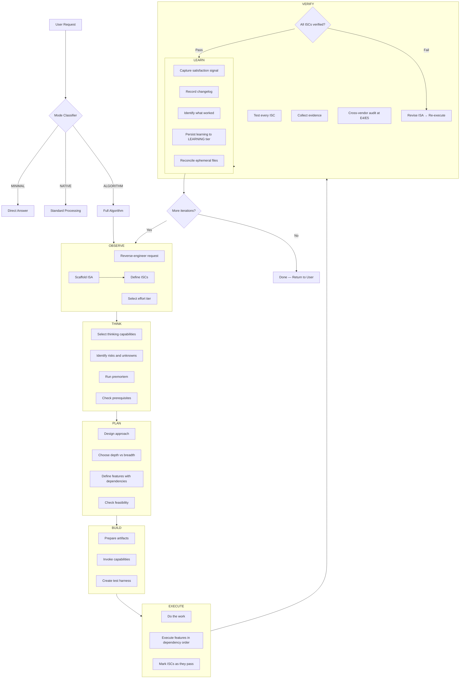
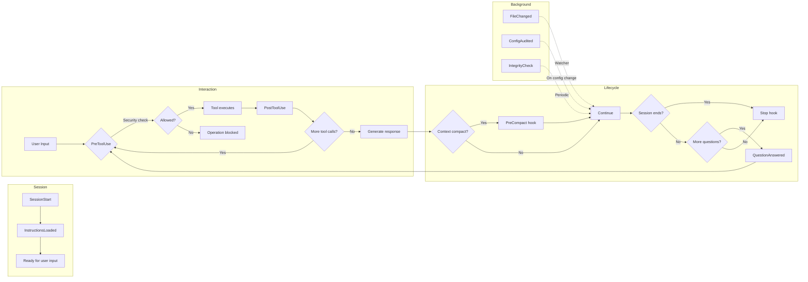
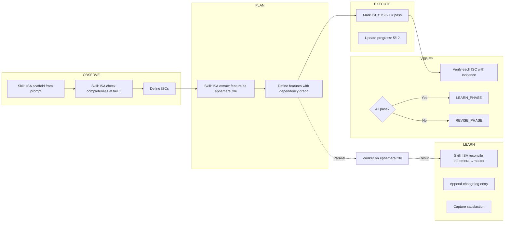
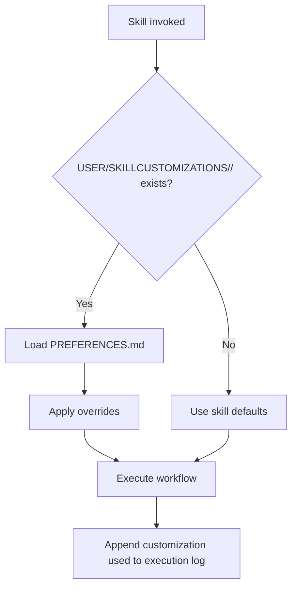
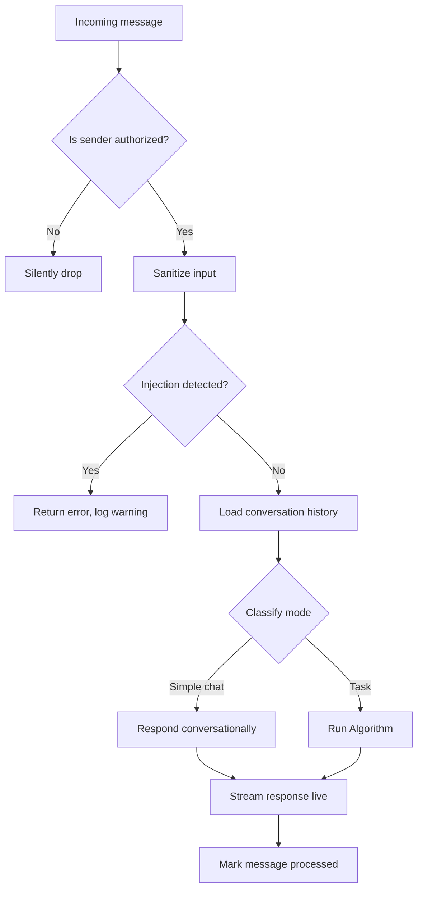
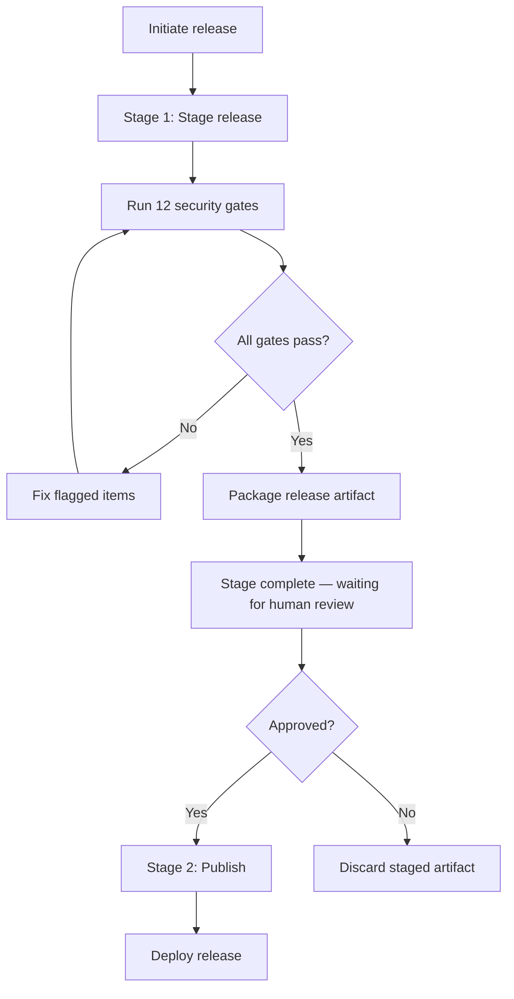
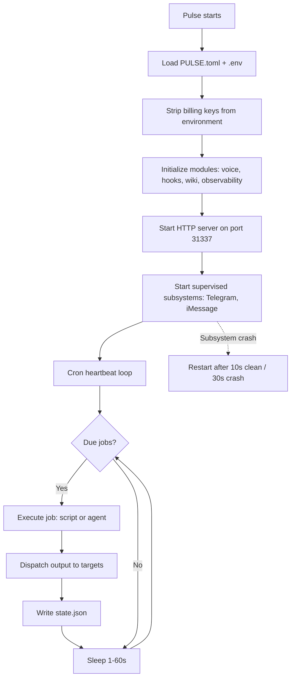
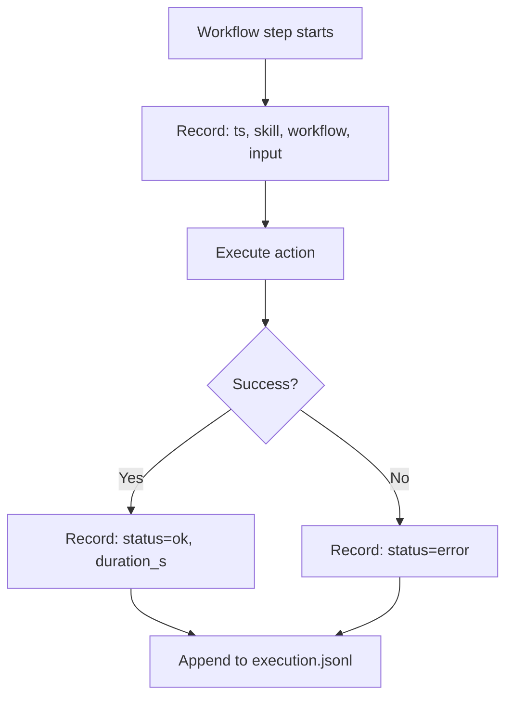

# PAI v5.0 — Flow Maps

## FL-01: Algorithm Main Lifecycle [HIGH]



## FL-02: Skill Invocation Flow [HIGH]

```mermaid
flowchart TD
    ALGO[Algorithm Phase] -->|"Skill('Name', 'action')"| SKILL[Skill Loaded]
    SKILL --> CUST{User customization exists?}
    CUST -->|Yes| LOAD_CUST[Load PREFERENCES.md override]
    CUST -->|No| DEFAULT[Use skill defaults]
    LOAD_CUST --> NOTIFY[Fire voice notification]
    DEFAULT --> NOTIFY
    NOTIFY --> ROUTE[Match action to Workflow Routing Table]
    ROUTE --> WF[Load Workflow file]
    WF --> STEP1[Execute Step 1]
    STEP1 --> STEP2[Execute Step 2]
    STEP2 --> MORE{More steps?}
    MORE -->|Yes| STEP_N[Next step]
    MORE -->|No| LOG[Append to execution log]
    LOG --> RESULT[Return result]
    STEP_N -.->|"Cross-invocation"| OTHER_SKILL[Other skill via Skill()]
    OTHER_SKILL -.-> RESULT
```

## FL-03: Hook Lifecycle Events [HIGH]



## FL-04: ISA Lifecycle Through Algorithm [HIGH]



## FL-05: Memory Read Flow [MEDIUM]

```mermaid
flowchart TD
    AGENT[Agent needs context] --> WHAT{What kind?}
    WHAT -->|Current task| READ_WORK[Read MEMORY/WORK/{slug}/ISA.md]
    WHAT -->|Entity knowledge| READ_KNOWLEDGE[Search MEMORY/KNOWLEDGE/]
    WHAT -->|Past patterns| READ_LEARNING[Search MEMORY/LEARNING/]
    WHAT -->|User identity| READ_USER[Read MEMORY/../USER/ files]
    WHAT -->|System config| READ_PAI[Read MEMORY/../PAI/ files]
    WHAT -->|Project context| READ_PROJECT[Read MEMORY/PROJECT/{name}/]

    READ_WORK --> RESULT[Return context]
    READ_KNOWLEDGE --> RESULT
    READ_LEARNING --> RESULT
    READ_USER --> RESULT
    READ_PAI --> RESULT
    READ_PROJECT --> RESULT
```

## FL-06: Skill Customization Lookup [MEDIUM]



## FL-07: Telegram iMessage Message Processing [MEDIUM]



## FL-08: Secure Release Flow [HIGH]



## FL-09: Pulse Daemon Lifecycle [MEDIUM]



## FL-10: Skill Invocation Execution Log [MEDIUM]


